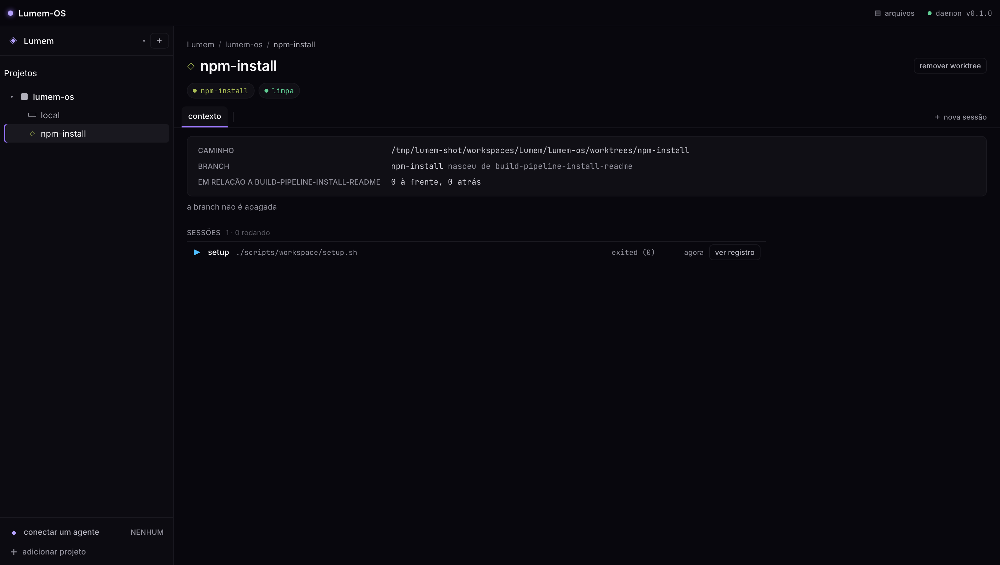

# Lumem-OS

> 🇺🇸 [Read in English](README.md) — o inglês é a porta do repositório e do npm;
> o resto da documentação vive em `docs/`, em português.

Um harness local para rodar agentes de código em worktrees do git. Um daemon na
sua máquina, uma aba do navegador, e uma hierarquia que é a do trabalho:
**workspace → projeto (um repo git) → worktree**.



Cada worktree é um `git worktree` de verdade no disco, com branch própria,
conversa própria com o agente, terminal próprio e portas reservadas — então
várias tarefas rodam ao mesmo tempo sem uma atropelar a outra.

## Instalar

```sh
npm i -g lumem
lumem
```

O daemon sobe em `http://127.0.0.1:4317` e serve a interface na mesma porta.
`lumem --open` abre o navegador junto.

Ainda não está publicado — quem publica é a primeira tag `v0.1.0`. Até lá, de um
clone:

```sh
pnpm install
pnpm build
npm i -g ./packages/cli
```

**O que a máquina precisa:**

| | |
|---|---|
| Node | 22 ou mais novo |
| git | 2.30 ou mais novo — o produto inteiro é worktree |
| Um agente ACP | o CLI `claude`, para a conversa. A tela de primeiro acesso instala o adaptador |
| Sistema | macOS e Linux. Windows não é suportado ([por quê](docs/project/backlog.md)) |

Nada além disso: as duas dependências nativas (`better-sqlite3`, `node-pty`)
publicam binários prontos, então a instalação global não compila nada nas
plataformas comuns. Verificado em macOS arm64 e Linux x64; as outras
arquiteturas não foram testadas.

Tudo o que o Lumem escreve mora em `~/.lumem` — registro SQLite, worktrees,
conversas, memória. `--state-dir` muda o lugar.

## O que ele faz

| | |
|---|---|
| [Projetos e worktrees](docs/prd/walking-skeleton/prd.md) | registre um repo por caminho ou [clone de uma URL](docs/prd/project-from-url/prd.md); corte worktrees pelo produto, e não pelo terminal |
| [Conversa por ACP](docs/prd/acp-sessions/prd.md) | plano, uso e custo, comandos de barra, terminal embutido, e a conversa **em disco** — fechar o Lumem não perde nada |
| [Arquivos, diff e editor](docs/prd/file-editor/prd.md) | navegue o checkout, leia o diff contra a branch base, edite com autosave |
| [Scripts do projeto](docs/prd/project-scripts/prd.md) | `setup`, `run` e `test` moram no `<repo>/.lumem/project.toml`; a worktree nova nasce preparada, e um clique sobe a aplicação numa porta reservada para aquele checkout |
| [Memória do workspace](docs/prd/workspace-memory/prd.md) | o que o harness aprendeu, versionado em git, atrás de um portão de escrita e de uma inbox de propostas. Os três interruptores que gastam token vêm **desligados** |
| [Status de PR](docs/prd/pull-request-status/prd.md) | desenhado, não implementado: qual das suas worktrees dá pra mesclar |

## Como funciona

- um **daemon** (Fastify + tRPC + WebSocket) é dono de todo processo, toda
  worktree e do banco; é a única coisa que toca o disco;
- um cliente **React**, servido pelo daemon em produção e pelo vite em
  desenvolvimento, que fala com ele em caminho relativo;
- **SQLite** no `~/.lumem` para o registro, mais um arquivo por conversa;
- **worktrees de verdade** — sem checkout virtual, sem cópia sombra. O que o
  Lumem mostra é o que o `git worktree list` vê;
- **ACP** ([Agent Client Protocol](docs/project/pty-vs-acp.md)) para o agente, e
  PTY para shell. A decisão, e o que ela custou, está escrita.

## Desenvolver

```sh
pnpm install
pnpm dev            # daemon na :4317, vite na :4318
```

| Comando | O que roda |
|---|---|
| `pnpm gate:quick` | os testes afetados pelo trabalho atual |
| `pnpm gate:full` | a suíte inteira mais o e2e |
| `pnpm gate:build` | typecheck de tudo, depois build |
| `pnpm smoke:install` | empacota o tarball, instala num prefixo descartável, e sobe |

A documentação é o mapa: [docs/README.md](docs/README.md) indexa o PRD de cada
feature, as decisões de projeto, a [matriz de testes](docs/project/testing.md) e
o [backlog](docs/project/backlog.md).

## Estado

**0.1.0.** Onze features de pé, e o produto vai de um `~/.lumem` vazio até um
turno respondido sem tocar em arquivo de configuração. É um projeto pessoal, em
uso diário por quem o escreve, e não promete estabilidade de API.

## Licença

[MIT](LICENSE).
