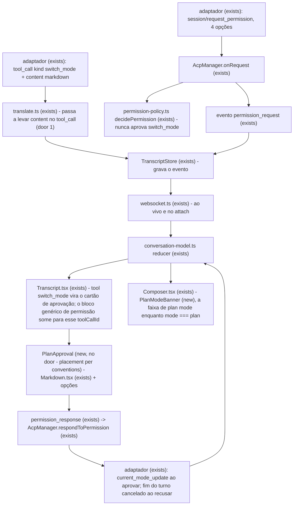

# PRD — O plano do plan mode, visível e decidido com ele inteiro na tela

> **Status:** em execução
> **Histórico:** v0.1 — proposta em **2026-09-29**, a partir da
> [LUM-65](https://linear.app/lumem-os/issue/LUM-65/plano-estado-visivel-em-plan-mode-e-aprovar-ou-recusar-o-plano-com-ele).
> A issue pedia `033-conversation-essentials`; o `033` já é da
> [`033-acp-only-agents`](../033-acp-only-agents/prd.md), e pela regra 1 da
> [`025`](../025-docs-contract/prd.md) esta é a **`035`**, com o escopo da issue — as duas partes do
> plano, e não o projeto *Conversa* inteiro
> **Perguntas:** [open-questions.md](open-questions.md) — 4 perguntas, **todas respondidas** em
> 2026-09-29, **todas pela proposta**; cada uma virou critério (5, 9, 11, 17)
> **Depende de:** a [`006-acp-sessions`](../006-acp-sessions/prd.md) (a permissão, o veredito e a
> A13 — *texto do agente é literal*), a [`016-session-mode`](../016-session-mode/prd.md) (a pílula e a
> política do Lumem) e o [ADR do modelo ser nosso](../../adr/2026-09-13-0038-our-model-is-king-outsiders-adapt.md)

Primeiro fluxo de feature no formato do
[ADR de 2026-09-28](../../adr/2026-09-28-1952-a-feature-is-proven-by-checks-not-planned-in-tasks.md):
este arquivo é o plano, e o `checks.md` nasce depois que ele for aprovado.

## Problem

Quando uma sessão entra em plan mode, a única coisa que muda na tela é a cor de uma pílula
(`.pill--plan`, `packages/web/src/features/conversation/conversation.css:561`). Nada diz, em palavras,
que o agente não vai alterar arquivos até o plano ser aprovado — quem não sabe o que a cor azul quer
dizer manda *"pode implementar"* no composer e espera código que não vem.

Quando o agente termina o plano, ele pede para sair do plan mode. O adaptador do Claude
(`claude-agent-acp@0.75.1`, a cópia do daemon) manda o tool call `kind: "switch_mode"`, título
**"Approve Plan"**, com **o plano inteiro em markdown** no `content` (`dist/tools.js:277-285`), e uma
permissão com quatro opções (`dist/permissions/options/tools.js`, `buildExitPlanModePermissionOptions`):

| `optionId` | `kind` | `name` |
| --- | --- | --- |
| `exit-plan-clear-auto` | `allow_always` | *"Yes, clear context (N% used) and use auto mode"* — só quando há plano |
| `exit-plan-auto` | `allow_always` | *"Yes, and use auto mode"* (ou *bypass permissions* / *auto-accept edits*) |
| `exit-plan-default` | `allow_once` | *"Yes, manually approve edits"* |
| `reject` | `reject_once` | *"No, keep planning"* |

Hoje, o que a pessoa vê nessa hora:

- o plano vai para o corpo do `ToolCard`, que mostra **as últimas 12 linhas** (`OUTPUT_LINE_CEILING`,
  `ToolCard.tsx:56`) em texto cru — o começo do plano, que é onde está o objetivo, não aparece;
- quando o adaptador manda o plano no `tool_call` inicial (o caminho da permissão,
  `ensureToolCallEmitted`), ele **nem chega**: o tradutor do daemon descarta `content` do `tool_call`
  (`packages/server/src/acp/translate.ts:209-233`) e só o guarda no `tool_call_update`;
- a permissão aparece como qualquer outra — *"Approve Plan"* e quatro botões, sem o plano ao lado —, e
  uma delas apaga o contexto da conversa;
- em `liberado` (a política do Lumem, `016`), um pedido `switch_mode` com opção `allow_once` seria
  **aprovado sozinho** (`permission-policy.ts:47-88`) — o único caminho hoje é o de um agente sem
  modos, mas nada o impede;
- **nunca foi exercitado**: zero `switch_mode` nos 34 transcripts em disco, e o agente falso
  (`e2e/support/fake-acp-agent.mjs`) nunca emite um.

Quando isto sair: em plan mode, uma faixa acima do composer diz o que o modo significa; quando o plano
fica pronto, ele aparece **inteiro e renderizado** num cartão com as opções do adaptador, e depois da
decisão o cartão vira o registro do que foi decidido — também ao reabrir a conversa.

## Flow

Reusa o que existe: o `Markdown.tsx` que a mensagem do agente já usa, o `PendingPermission` e o
`verdict`/`verdictBy` que o reducer já liga ao tool call pelo `toolCallId` — mais um campo novo ao lado
deles, `askWithdrawn`, para o pedido que o agente retirou (`cancelled`), que não é veredito —, o `respondToPermission`
do daemon, e o `TranscriptStore` — que grava o evento como ele saiu, então o registro sobrevive a
reabrir sem nada novo.

O caminho ramifica — dois eventos do adaptador se encontram no mesmo cartão pelo `toolCallId`, e a
faixa lê só o `mode` —, por isso o diagrama.

A faixa (Parte 1) é `single module - Composer`: lê `conversation.mode`, que o reducer já tem
(`conversation-model.ts:399-406`), num componente próprio (`PlanModeBanner.tsx`) que o `Composer`
põe logo acima da `ComposerBox`.

## Impact

| Front | What changes |
| --- | --- |
| domain | termo novo: **plano** passa a ser o texto que o agente pede para aprovar ao sair do plan mode — vive no tool call `switch_mode` |
| domain | termo existente: `PlanCard` e o rótulo **"Plano"** (`PlanCard.tsx:47-55`) nomeiam a **lista de passos** do agente (`sessionUpdate: "plan"`); o rótulo passa a ser **"Passos"** ([Q3](open-questions.md)); componente e evento mantêm o nome |
| contract | o evento `tool_call` (`packages/shared/src/acp-protocol.ts:269-277`) ganha `content` opcional; quem lê hoje: o reducer do web (`conversation-model.ts`) e o `AcpManager` (`kindOf`, `commandOf`) — nenhum quebra com um campo a mais |
| política | `decidePermission` passa a recusar-se a aprovar `switch_mode` nos três valores; o `automático` já não aprovava (só `read`), o `liberado` aprovava |
| stored data | nada a migrar: transcripts antigos não têm `content` no `tool_call` e a leitura é *forward-compatible* (`TranscriptStore.ts`); os novos passam a gravá-lo |
| e2e | o agente falso ganha um roteiro de plan mode, por palavra-chave no prompt, sem mudar o turno padrão que as outras 17 specs usam |

## Relations

None - no stored-data shape change. O transcript continua uma sequência de eventos; o que muda é um
campo opcional dentro de um deles, e ele está em `Landing`.

## Surface

Nada novo é consumido fora do repositório: o WebSocket do daemon e o formato do transcript são lidos
só pelo web e pelo próprio daemon. O contrato que muda é interno e está em `Landing`.

None - nothing consumed outside

## Landing

| One-way door | Literal shape | Alternative rejected |
| --- | --- | --- |
| o `tool_call` leva `content` | `acpEventSchema` `tool_call` ganha `content: z.array(acpToolContentSchema).optional()`, traduzido pelo mesmo `toolContent()` do `tool_call_update`; ausente quando o adaptador não mandou | um campo `plan` no `permission_request` — carrega o plano duas vezes, o `ToolCard` continuaria cortado, e `plan` é vocabulário do Claude no contrato do Lumem (contra o [ADR do modelo](../../adr/2026-09-13-0038-our-model-is-king-outsiders-adapt.md)); ler `rawInput.plan` — é a forma de entrada de uma ferramenta de um adaptador, não ACP |
| o transcript grava o `content` do `tool_call` | o evento é gravado como sai do tradutor, então todo transcript novo passa a ter o campo, para sempre (append-only) | gravar sem `content` e recompor na leitura — quebra o *replay = stream ao vivo* em que o reducer se apoia |

- Nothing else in this change is hard to reverse: a faixa, o cartão e o rótulo são componente e CSS; a
  guarda da política é uma condição

## Criteria

### S1: a faixa de plan mode (P1)

Em plan mode, a pessoa lê — não deduz da cor — que o agente não vai alterar arquivos.

**Acceptance Criteria**

1. WHILE a conversa está viva e `conversation.mode === "plan"` the composer SHALL mostrar, acima da caixa de texto, uma faixa com `role="status"` e o texto exato *"modo plano — o agente não altera arquivos até você aprovar o plano"*
2. WHEN um evento `config` troca o `mode` de `"plan"` para qualquer outro valor THEN the composer SHALL deixar de mostrar a faixa na mesma renderização
3. WHILE `conversation.mode` é diferente de `"plan"` — incluindo `""`, do agente sem modos — the composer SHALL não mostrar a faixa
4. IF a conversa está em leitura (`readOnly`) THEN the composer SHALL não mostrar a faixa, mesmo com `mode === "plan"`
5. The `PlanCard` SHALL mostrar o rótulo *"Passos"* no lugar de *"Plano"* ([Q3](open-questions.md))

**Independent test:** no e2e, mandar o prompt do roteiro de plan mode e ver a faixa aparecer; aprovar e ver a faixa sumir.

### S2: o plano chega inteiro ao web (P1)

O markdown do plano chega ao reducer por qualquer um dos dois caminhos do adaptador.

**Acceptance Criteria**

6. WHEN o adaptador manda `session/update` `tool_call` com `content` THEN the daemon SHALL emitir o evento `tool_call` com esse `content` traduzido, item por item, como já faz no `tool_call_update`
7. WHEN o adaptador manda `tool_call` sem `content` THEN the daemon SHALL emitir o evento sem o campo `content`
8. WHEN o reducer recebe um `tool_call` com `content` THEN the web SHALL guardar esse `content` no `ToolCallView`, e um `tool_call_update` com `content` posterior SHALL substituí-lo, como hoje
9. The daemon SHALL nunca aprovar sozinho um pedido de permissão cujo tool call tem `kind: "switch_mode"`, nos três valores da política do Lumem (`ask`, `auto`, `free`) — o pedido fica pendente com `policyReason` *"aprovar um plano é decisão sua"*

**Independent test:** teste de integração do tradutor e da política, sem web.

### S3: aprovar ou recusar com o plano inteiro na tela (P1)

O pedido de sair do plan mode vira um cartão com o plano renderizado e as opções do adaptador.

**Acceptance Criteria**

10. WHILE há permissão pendente cujo `toolCallId` é de um tool call `kind: "switch_mode"` the transcript SHALL mostrar, na posição do tool call, um cartão de aprovação com o `content` de texto renderizado pelo `Markdown.tsx` — todas as linhas, sem o teto de 12 —, e SHALL não mostrar o bloco genérico de permissão para esse pedido
11. WHILE o cartão de aprovação está pendente the transcript SHALL mostrar um botão por opção do pedido, com o `name` do adaptador verbatim, as de `kind` `allow_*` na ordem em que o adaptador as mandou, e a de `reject_once` separada delas, depois, sob o texto do Lumem *"ou continuar planejando"*
12. WHEN a pessoa clica numa opção do cartão THEN the web SHALL mandar `permission_response` com o `optionId` dessa opção
13. WHILE o cartão de aprovação está pendente the web SHALL manter as teclas de hoje do pedido de permissão: Enter escolhe a primeira `allow_once`, Esc escolhe a `reject_once`
14. WHEN chega `permission_resolved` com uma opção de `kind` `allow_once` ou `allow_always` THEN the cartão SHALL virar registro, sem botões, com o texto *"plano aprovado — "* seguido do `name` da opção escolhida
15. WHEN chega `permission_resolved` com a opção de `kind` `reject_once` THEN the cartão SHALL virar registro, sem botões, com o texto *"você pediu para continuar planejando"*
16. IF chega `permission_resolved` com `outcome: "cancelled"` THEN the cartão SHALL virar registro, sem botões, com o texto *"pedido cancelado"*
17. WHILE o cartão é registro the transcript SHALL mostrar o plano recolhido, com um botão *"ver o plano"* que o expande inteiro
18. IF o tool call `switch_mode` não tem nenhum `content` de texto THEN the cartão SHALL mostrar *"o agente não mandou o texto do plano"* no lugar do plano, e as opções continuam
19. WHEN uma conversa com um plano decidido é reaberta do disco THEN the transcript SHALL mostrar o mesmo registro, com o mesmo texto do critério 14, 15 ou 16

**Independent test:** e2e contra o roteiro de plan mode do agente falso — ver o plano inteiro, aprovar, ver o registro e a faixa sumir; recarregar e ver o registro.

### S4: o roteiro de plan mode no agente falso (P1)

O fluxo passa a ser exercitado a zero token, e serve de e2e para S1 e S3.

**Acceptance Criteria**

20. WHEN o agente falso recebe um prompt que contém *"planeje antes"* THEN the agente falso SHALL emitir `current_mode_update` para `plan`, um `tool_call` `kind: "switch_mode"` título *"Approve Plan"* com um plano markdown de mais de 12 linhas **no `tool_call`**, e `session/request_permission` com as quatro opções do adaptador `0.75.1` (`exit-plan-clear-auto`, `exit-plan-auto`, `exit-plan-default`, `reject`), com os mesmos `kind` e `name`
21. WHEN o pedido do roteiro é respondido com `exit-plan-auto` ou `exit-plan-clear-auto` THEN the agente falso SHALL emitir `current_mode_update` para `auto` e terminar o turno com `end_turn`; com `exit-plan-default`, para `default`
22. WHEN o pedido do roteiro é respondido com `reject` THEN the agente falso SHALL continuar em `plan` e terminar o turno com `stopReason: "cancelled"`, como o adaptador faz (`permissions/effects.js`, *"User chose to keep planning"*, com interrupção)
23. The agente falso SHALL manter o turno padrão (`runTurn`) sem nenhuma mudança para prompt que não contém *"planeje antes"*

**Independent test:** as specs existentes que usam o agente falso continuam verdes; a nova spec exercita o roteiro.

## Out of scope

| Excluded | Why |
| --- | --- |
| comentar o plano linha a linha, ou editá-lo antes de aprovar | o adaptador aceita só um `optionId`; o que a pessoa quer mudar vai no próximo prompt, que é o que *"No, keep planning"* já pressupõe |
| a entrada no plan mode pedida pelo agente (`EnterPlanMode`, *"Yes, enter plan mode"*) com cartão próprio | é uma permissão de duas opções sem conteúdo; o bloco genérico a mostra inteira |
| traduzir as opções do adaptador | a [Q1](open-questions.md) respondeu verbatim, pela A13 |
| o resto do projeto *Conversa* (imagem, reasoning, sinal de vida) | a issue é só o plano; cada parte do projeto abre a sua feature |

## Assumptions

| Assumption | Chosen default | Rationale | Confirmed? |
| --- | --- | --- | --- |
| o fim de turno cancelado depois de *"No, keep planning"* | desenhado como o de hoje, sem tratamento especial | é o adaptador quem interrompe; o registro do cartão já diz o que aconteceu, e mudar o marcador de cancelamento é outra conversa | n |
| id do modo | a faixa lê o valor literal `"plan"`, como o `MODE_TONE` da pílula (`ConfigPills.tsx:20-24`) | Claude e Codex usam o mesmo id; a pílula já depende dele | n |
| a palavra-chave do roteiro | *"planeje antes"* | segue o padrão das outras (*"estoure a cota"*, *"falhe o turno"*) e não colide com nenhuma | y |

**Open questions:** none - as quatro de [open-questions.md](open-questions.md) foram respondidas e viraram os critérios 5, 9, 11 e 17.

## Observable

| Surface | Decision | Landing |
| --- | --- | --- |
| screen composer · faixa | estado vazio (fora de plan mode) | AC 3 |
| screen composer · faixa | conversa em leitura | AC 4 |
| screen composer · faixa | carregando | n/a - a faixa lê `mode`, que chega no frame de attach junto com o resto; não há espera própria |
| screen composer · faixa | erro | n/a - não há chamada; a faixa só lê o estado |
| screen composer · faixa | tom e contraste | existing - o gate de tokens e de contraste de `tokens.css` confere `--color-mode-plan` sobre `--color-bg-info-subtle` |
| screen transcript · cartão de aprovação | estado pendente | AC 10, AC 11 |
| screen transcript · cartão de aprovação | plano sem texto | AC 18 |
| screen transcript · cartão de aprovação | depois da decisão | AC 14, AC 15, AC 16, AC 17 |
| screen transcript · cartão de aprovação | carregando | n/a - o cartão nasce de eventos que já chegaram; não busca nada |
| screen transcript · cartão de aprovação | não autorizado | n/a - o daemon não tem autenticação ainda ([`019`](../019-daemon-auth/prd.md), proposta) |
| screen transcript · cartão de aprovação | ação destrutiva confirma antes | n/a - *"clear context"* é escolha do adaptador e o texto dele aparece verbatim (Q1); um segundo clique de confirmação seria um diálogo que o adaptador não pediu |
| screen transcript · cartão de aprovação | densidade e ordem das opções | AC 11 |
| screen transcript · cartão de aprovação | teclado | AC 13 |
| screen transcript · lista de passos | rótulo | AC 5 |
| document plano do agente | estrutura e profundidade | AC 10 - renderizado pelo `Markdown.tsx`, sem corte |

## Sources

- [LUM-65](https://linear.app/lumem-os/issue/LUM-65/plano-estado-visivel-em-plan-mode-e-aprovar-ou-recusar-o-plano-com-ele) - as duas partes, as propostas da Q1 e da Q2
- `claude-agent-acp@0.75.1` em `~/.lumem/adapters/claude/` - `dist/tools.js:277-285`, `dist/permissions/options/tools.js`, `dist/permissions/effects.js`: o tool call, as quatro opções e o que cada uma faz
