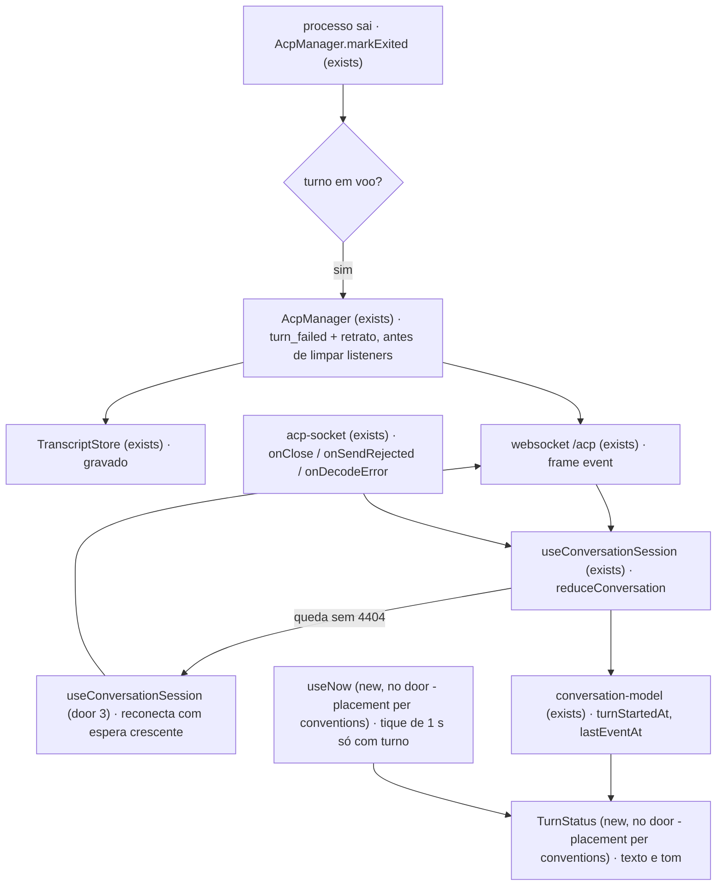

# PRD — Sinal de vida da conversa

> **Status:** em execução
> **Histórico:** v0.1 — proposta em **2026-09-29**, a partir da
> [LUM-67](https://linear.app/lumem-os/issue/LUM-67/conversa-sinal-de-vida-saber-se-o-agente-ainda-esta-trabalhando),
> do projeto *Conversa — imagem, plano, reasoning e sinal de vida*. A issue pedia
> `033-conversation-essentials`; o `033` já é a [acp-only-agents](../033-acp-only-agents/prd.md), e esta
> pasta cobre só o sinal de vida — as outras entregas do projeto ganham número próprio.
> A Parte 1 foi **medida antes de ser planejada** (§Problem): metade do defeito que a issue descreve já
> tinha sido consertada pelo `turn_failed` da `028`/`034`, e o que sobrou é mais estreito.
> v0.2 — **as três perguntas respondidas a favor da proposta** em 2026-09-29, e o
> [checks.md](checks.md) derivado.
> v0.3 — **a verificação da rodada 1 reprovou** (2026-09-29): as duas guardas de corrida que a S1
> acrescentou não tinham prova. Os critérios 27 e 28 nasceram dela, com a
> [Q4](open-questions.md#x-q4--a-pergunta-fica-gravada-quando-o-adaptador-morre-antes-de-recebê-la)
> respondida em **A**: a pergunta fica gravada.
> v0.4 — **a verificação da rodada 2 reprovou** (2026-09-29): a guarda da rodada 1 lia a troca de
> `turnId` de um segundo `prompt` como a saída. O critério 29 nasceu dela, com a
> [Q5](open-questions.md#x-q5--dois-prompt-na-mesma-sessão-ao-mesmo-tempo-são-permitidos) respondida
> em **B** — dois `prompt` na mesma sessão continuam permitidos — e a
> [Q6](open-questions.md#x-q6--o-prompt-pendente-do-setup-perde-o-reenvio-automático) em **A**.
> v0.5 — **renumerada de `035` para `037` em 2026-09-29**: colidiu com a
> [`035-plan-mode`](../035-plan-mode/prd.md) e a [`036-reasoning`](../036-reasoning/prd.md), que
> entraram na `main` antes; esta nunca tinha entrado. Os commits anteriores citam `035` no trailer.

## Problem

Numa conversa, um agente pensando há três minutos e um agente morto desenham o mesmo pixel. Quem
paga é quem está olhando a aba: não sabe se espera, se interrompe ou se recomeça, e a única pista na
tela é o botão `■ interromper esc` (`Conversation.tsx`), que aparece igual nos dois casos. O caret
`.mcaret` é estático — nenhum `@keyframes` em `conversation.css` — e, logo depois do envio, fica
desenhado **na mensagem da própria pessoa**, porque a regra dele em `Transcript.tsx` só pergunta se
é o último bloco. Com uma ferramenta longa rodando não há caret nenhum: só o rótulo `rodando` e um
ponto parado no `ToolCard`. E não existe tempo decorrido do turno em lugar nenhum.

Por baixo disso, dois defeitos que nenhum indicador conserta sozinho:

- **O turno que não fecha quando o adaptador morre.** Medido em 2026-09-29 contra o código de hoje,
  com dois spikes descartados depois:
  - com um **processo real** morto por `SIGTERM` ou `SIGKILL` no meio do turno, o stdout fecha, o SDK
    do ACP rejeita o `session/prompt` com `ACP connection closed`, e o `catch` do `prompt` já emite
    `turn_failed` — ao vivo e na transcrição. **Esse caminho já fecha**, e a issue foi escrita antes
    dele;
  - com o **agente falso em memória**, cujo `kill()` resolve `exited` sem fechar os streams, o
    `prompt` fica pendente para sempre e a transcrição termina em `message` do usuário. O daemon
    depende de o stdout fechar para fechar o turno, e `markExited` não fecha nada: marca `exited`,
    cancela as permissões e **limpa os listeners**. Um adaptador que sai com o stdout ainda aberto —
    herdado por um neto, por exemplo — deixa `promptInFlight` ligado, e o `liveTurns()`, que não
    filtra sessão encerrada, faz o selo do quadro pintar *implementando há 3 h* numa sessão morta.
    Se isso acontece com o `claude-agent-acp` de verdade **não foi medido** — a regra de
    [*a forma do erro do fake não é a forma do erro do adaptador*](../../project/testing.md#a-forma-do-erro-do-fake-não-é-a-forma-do-erro-do-adaptador)
    vale ao contrário aqui: o conserto não pode depender da forma que o estrangeiro fecha;
  - a mensagem que chega hoje é `ACP connection closed`, vocabulário do SDK;
  - e uma transcrição gravada **antes** de qualquer fecho — as que já estão em disco, ou as do caso
    acima — é relida com `streaming: true`, e o caret continua desenhado na conversa encerrada.
- **A queda do socket que a tela não percebe.** `useConversationSession` só liga `onMessage`; o
  `acp-socket` já expõe `onClose`, `onSendRejected` e `onDecodeError`, e ninguém os escuta. Se o
  `/acp` cai — daemon reiniciado, rede, ou um prompt acima do `maxPayload` de 1 MiB do servidor —, a
  conversa parece viva e parada ao mesmo tempo. E `send` devolve `true` mesmo quando o socket recusou
  o envio, então o composer limpa um rascunho que nunca saiu.

A issue não traz número de incidência; a evidência é o código acima e os dois spikes.

Quando isto sair: a linha acima do composer diz há quanto tempo o agente está trabalhando e fazendo
o quê; fica âmbar quando ele para de mandar sinal sem ter ferramenta rodando; o turno de um adaptador
morto fecha com uma frase que diz isso; e a queda da conexão aparece e se conserta sozinha.

## Flow

Reusa o `turn_failed` que já fecha uma recusa, o retrato `turn-failed` do `observeTurnFailure`, o
`onClose`/`onSendRejected` que o `acp-socket` já expõe, e o replay por `attached` que já substitui o
estado em vez de somar.

1. o processo do adaptador sai -> `AcpManager.markExited` (exists) - com `promptInFlight`, emite
   `turn_failed` (door 1) e o retrato `turn-failed`, solta a marca e liberta **todos** os `prompt` em
   voo, cada um pelo seu gatilho (Q5), **antes** de limpar os listeners; se a saída chegou enquanto o teto ou a memória eram lidos, grava
   antes a mensagem do usuário que o turno guardava, e o `prompt` rejeita com o mesmo
   `AcpTurnFailedError`, que o `websocket.ts` engole (Q4); sem turno em voo, nada muda
2. `TranscriptStore` (exists) grava a entrada; o websocket `/acp` (exists) a entrega a quem está anexado
3. `useConversationSession` (exists) - dobra o frame no `reduceConversation` (exists), que passa a
   guardar `turnStartedAt` e `lastEventAt` do `at` de cada entrada, puro
4. `acp-socket` (exists) avisa `onClose`; `useConversationSession` (door 3) mostra a queda e reconecta;
   o `attached` da volta substitui o estado inteiro, como hoje
5. out: `TurnStatus` (new, no door - placement per conventions) desenha a linha acima do composer, com
   o relógio do `useNow` (new, no door - placement per conventions), e `Transcript` (exists) só
   desenha o caret com `streaming && !readOnly` num bloco do agente

## Impact

| Front | What changes |
| --- | --- |
| domain | existing term: `turn_failed` meant "o `session/prompt` foi recusado", now means "o turno acabou sem `turn_end`: recusado, ou o adaptador saiu no meio" — o `reduceConversation` (fecha `streaming`), o `turn-close-text.ts` (a frase) e o `websocket.ts` (engole o `AcpTurnFailedError`) ramificam nele hoje; nenhum conta turno por ele, e é por isso que ele serve |
| domain | existing term: `promptInFlight` passa a ser solto também na saída do processo — `liveTurns()` (selo do quadro, `028` T7) e o `setConfig`, que recusa no meio do turno, leem ele |
| domain | new term: *silêncio* — turno em voo, nenhuma ferramenta `pending`/`running`, nenhuma permissão pendente, e nenhum evento há 90 s ou mais; mora no `web`, derivado, nunca gravado |
| contract | `@lumem/shared` passa a exportar o limite de frame do `/acp` (1 MiB); o `websocket.ts` deixa de ter a constante própria e o `acp-socket` a lê para recusar antes do fio |
| client | `AcpSocket.send` passa a devolver `boolean`; o único chamador é `useConversationSession` |
| stored data | nothing to migrate — transcrições antigas sem fecho continuam como estão; a tela as lê certo porque `readOnly` desliga o que é de turno vivo |

## Relations

`None - no stored-data shape change`

## Surface

`None - nothing consumed outside` — o `/acp` ganha uso novo de uma variante que já existe
(`turn_failed`) e nenhuma variante, campo ou código de fechamento novo.

## Landing

| One-way door | Literal shape | Alternative rejected |
| --- | --- | --- |
| 1. o fecho de um turno cujo adaptador saiu, gravado para sempre na transcrição | `{ type: "turn_failed", message: "o agente encerrou no meio do turno (saída 137)" }` — ou `(sinal SIGKILL)`, ou `(saída desconhecida)` | `turn_end` com `stopReason` novo — o enum é do ACP (`acpStopReasonSchema`) e o `turn_end` é onde o teto `turnsPerSession` conta turno; evento próprio `agent_exited` — uma variante nova quebra o decode de um bundle web em cache mais velho que o daemon, e não diz nada que o `turn_failed` não diga |
| 2. um fecho só por turno | o `prompt` só emite o seu `turn_failed` se o `turnId` que ele abriu ainda é o turno em voo; `markExited` fecha e zera o `turnId` — *nota (rodada 2): o mecanismo do `turnId` foi substituído pela door 4, que o lia errado com dois `prompt`; a regra de um fecho só por turno fica de pé* | dedup no redutor — dois fechos continuariam gravados, e a transcrição é a fonte |
| 3. reconexão mora no hook, não no socket | `useConversationSession` reabre com `connect()` a 0,5 s, 1 s, 2 s, 4 s, 8 s e depois 10 s fixos; o `acp-socket` segue *um socket, uma vida* | reconexão dentro do `acp-socket` — o contrato dele diz que fechar é destacar, e um socket que se reabre sozinho reenviaria sem ninguém ter escolhido o momento; é o padrão que o `pty-socket` copiaria |
| 4. cada `prompt` em voo tem o seu gatilho de saída (achada na rodada 2, Q5) | o `prompt` guarda um registro por turno — a pergunta, o gatilho que rejeita o pedido e o `failure` que a saída lhe põe —, e as guardas leem o `failure` do **próprio** turno; `markExited` fecha uma vez e liberta todos. Dois `prompt` na mesma sessão continuam permitidos, como em `origin/main`. Substitui o *"`turnId` que ele abriu ainda é o turno em voo"* da door 2, que lia um `prompt` novo como a saída | recusar o segundo `prompt` com um `DomainError` (Q5 A) — mudaria o comportamento de `origin/main`, e a tela não barra o segundo por completo |

- Nothing else in this change is hard to reverse

## Criteria

### S1: o turno fecha quando o adaptador morre (P1)

Um adaptador que sai no meio do turno deixa na conversa, ao vivo e no replay, uma linha que diz isso.

**Acceptance Criteria**

1. WHEN o processo do adaptador sai com um turno em voo THEN o daemon SHALL emitir exatamente um `turn_failed` com a mensagem `o agente encerrou no meio do turno (saída <código>)` — `(sinal <nome>)` quando saiu por sinal, `(saída desconhecida)` quando nenhum dos dois veio —, gravado na transcrição e entregue aos listeners anexados antes de eles serem limpos
2. WHEN o processo sai com um turno em voo e o stdout nunca fecha THEN o daemon SHALL rejeitar o `prompt` daquele turno com `AcpTurnFailedError` e deixar `liveTurns()` sem a sessão
3. IF o `session/prompt` rejeita depois de a saída já ter fechado o turno THEN o daemon SHALL não emitir um segundo `turn_failed`
4. WHEN o processo sai sem turno em voo THEN o daemon SHALL não emitir `turn_failed`
5. WHEN a saída fecha um turno THEN o daemon SHALL gravar o retrato `turn-failed` do `observeTurnFailure` com `code: "exited"`
6. WHILE a conversa é somente leitura the web SHALL não desenhar o caret, a linha de estado do turno nem o `■ interromper`, inclusive numa transcrição que termina em mensagem do usuário sem fecho
27. IF o processo sai enquanto o daemon lê o teto ou a memória, antes do `session/prompt`, THEN o daemon SHALL gravar a mensagem do usuário seguida de um único `turn_failed` com a frase da saída, não SHALL mandar `session/prompt`, e o `/acp` SHALL não mandar frame `error` por cima
28. IF a resposta do `session/prompt` e a saída do processo chegam no mesmo tique THEN o daemon SHALL gravar um único fecho, o `turn_failed` da saída, e nenhum `turn_end`
29. WHEN um segundo `prompt` chega à mesma sessão com um turno em voo THEN o daemon SHALL deixar os dois terminarem — nenhum fica pendente, nenhum rejeita como saída sem o processo ter saído —, e IF o processo sai com os dois em voo THEN os dois SHALL rejeitar com `AcpTurnFailedError`

**Independent test:** no teste do `AcpManager`, um agente falso cujo `kill()` não fecha o stdout, morto no meio de um `prompt` — a transcrição termina em `turn_failed` e o `prompt` rejeita.

### S2: a queda da conexão aparece e se conserta (P1)

Um socket `/acp` que cai vira aviso, e volta sozinho sem perder o rascunho nem duplicar a conversa.

**Acceptance Criteria**

7. WHEN o socket `/acp` fecha sem o cliente ter pedido e com código diferente de `4404` THEN a conversa SHALL mostrar o aviso `conexão com o daemon caiu — reconectando` e tentar reabrir
8. WHILE a conexão está caída the web SHALL tentar reabrir após 0,5 s, 1 s, 2 s, 4 s e 8 s, e depois a cada 10 s, enquanto a aba estiver montada
9. WHEN uma reabertura recebe `attached` THEN a conversa SHALL substituir o estado pelo replay e tirar o aviso, com o mesmo número de turnos de antes da queda
10. IF o socket fecha com `4404` THEN a conversa SHALL mostrar `esta sessão não existe mais no daemon` e SHALL não tentar reabrir
11. WHEN a aba desmonta ou troca de sessão THEN o web SHALL não tentar reabrir o socket antigo
12. IF o socket recusa um envio THEN `send` SHALL devolver `false` e o composer SHALL manter o rascunho e mostrar o motivo
13. IF o prompt codificado passa de 1 MiB THEN o web SHALL recusá-lo antes do fio com `mensagem grande demais — o limite é 1 MiB`, mantendo o rascunho
14. IF um frame do daemon não decodifica THEN a conversa SHALL mostrar o aviso não fatal `o daemon mandou algo que esta tela não entende — recarregue a página` e seguir com o socket aberto

**Independent test:** com o socket falso do `useConversationSession.test.tsx`, fechar com `1006` mostra o aviso, e o `attached` da segunda conexão o tira.

### S3: a linha de estado do turno (P1)

Enquanto há turno, uma linha acima do composer diz há quanto tempo e fazendo o quê.

**Acceptance Criteria**

15. WHEN o redutor recebe a mensagem do usuário que abre um turno THEN ele SHALL guardar `turnStartedAt` e `lastEventAt` iguais ao `at` dessa entrada, e cada evento seguinte do turno SHALL mover `lastEventAt` para o seu `at`
16. The redutor SHALL produzir o mesmo `turnStartedAt` e `lastEventAt` pelo `replayConversation` e pela dobra evento a evento da mesma transcrição
17. WHILE `streaming && !readOnly` the conversa SHALL mostrar acima do composer `trabalhando · <decorrido>` com um indicador animado
18. The decorrido SHALL se escrever `<s> s` abaixo de 60 s, `<m> min <s> s` abaixo de 1 h e `<h> h <mm> min` a partir daí, e `0 s` quando o relógio local estiver atrás do `at` do daemon
19. WHILE há turno the linha SHALL dizer o que o agente faz pelo último bloco do turno do agente: `pensando` para raciocínio, `escrevendo` para mensagem, `rodando <título>` para ferramenta `pending` ou `running`, `esperando sua resposta` para permissão pendente, `começando` quando o agente ainda não mandou nada, e `pensando` depois de uma ferramenta terminada
20. The relógio SHALL avançar uma vez por segundo só enquanto `streaming && !readOnly`, e não SHALL existir intervalo ligado fora disso
21. The caret SHALL piscar por `@keyframes`, e só SHALL ser desenhado no último bloco de um turno do agente, nunca na mensagem do usuário
22. WHERE `prefers-reduced-motion: reduce` vale the caret e o indicador da linha SHALL ficar parados

**Independent test:** teste de componente com relógio injetado — `turnStartedAt` 72 s atrás desenha `trabalhando · 1 min 12 s`.

### S4: o aviso de silêncio (P2)

Com turno em voo e nenhum sinal há 90 s, sem ferramenta rodando, a linha fica âmbar.

**Acceptance Criteria**

23. WHILE há turno sem ferramenta `pending`/`running` e sem permissão pendente, WHEN `now − lastEventAt` chega a 90 s THEN a linha SHALL tomar o tom `warning` e dizer `sem sinal do agente há <decorrido desde lastEventAt>` com o atalho `esc` de interromper
24. WHILE uma ferramenta está `pending` ou `running` the linha SHALL dizer `rodando <título> há <decorrido desde o início da ferramenta>` e SHALL não tomar o tom `warning`, qualquer que seja o silêncio
25. WHILE há permissão pendente the linha SHALL não tomar o tom `warning`
26. WHEN chega um evento do turno durante o aviso THEN a linha SHALL voltar ao tom normal no mesmo render

**Independent test:** relógio injetado 91 s depois do último `agent_message_chunk` desenha âmbar; o mesmo com um `tool_call` `running` não.

## Out of scope

| Excluded | Why |
| --- | --- |
| teto de tempo para o turno interativo | a esteira tem 30 min (`TURN_TIMEOUT_MS`); no interativo quem está olhando decide, e o aviso é o que dá a ela o dado para decidir |
| relógio andando dentro do `ToolCard` | a linha de estado diz há quanto tempo a ferramenta roda; um segundo relógio na mesma tela é uma segunda fonte para o mesmo número |
| sinal de vida na sidebar, na aba e no quadro | outro leitor, outra decisão de desenho; esta feature é a conversa aberta |
| reconexão do `/pty` | o terminal tem o seu socket e o seu defeito; o padrão desta (door 3) fica para ele copiar |
| limiar de silêncio configurável em `/settings` | um número só até uma semana de uso dizer se ele está errado |

## Assumptions

| Assumption | Chosen default | Rationale | Confirmed? |
| --- | --- | --- | --- |
| relógio do daemon e do navegador | o mesmo relógio, com o decorrido negativo virando `0 s` | o daemon roda na máquina de quem olha; se isso mudar, a `019-daemon-auth` é quem abre a porta | n |
| verbo para ferramenta que não é `execute` | `rodando <título>` para toda ferramenta | o título já nomeia o que é (`Read …`, `Edit …`); um verbo por `kind` é desenho que se ajusta depois de ver | n |
| a queda durante um turno | o turno continua no daemon, e a reabertura o mostra no ponto em que está | o daemon é dono da sessão desde a `006`; fechar o socket só destaca | n |
| mensagem de `onSendRejected` | o texto que o socket dá, abaixo do composer, até o próximo envio | é o motivo real; traduzir cada caso é trabalho sem leitor ainda | n |

**Open questions:** none - all resolved. As três do [open-questions.md](open-questions.md) foram
respondidas a favor da proposta em 2026-09-29: o limiar é 90 s
([Q1](open-questions.md#x-q1--o-limiar-do-silêncio-é-90-s)), a reconexão não desiste
([Q2](open-questions.md#x-q2--a-reconexão-desiste-algum-dia)) e o turno interativo não ganha teto
([Q3](open-questions.md#x-q3--o-turno-interativo-ganha-teto-de-tempo)).

## Observable

| Surface | Decision | Landing |
| --- | --- | --- |
| tela: conversa ao vivo | loading — conectando pela primeira vez | existing - o `attached` ainda não chegou e o `EmptyConversation` diz `ready={false}` |
| tela: conversa ao vivo | error — a conexão caiu | AC 7, AC 8 |
| tela: conversa ao vivo | error — a sessão sumiu do daemon | AC 10 |
| tela: conversa ao vivo | error — frame que não decodifica | AC 14 |
| tela: conversa ao vivo | empty — nenhum turno | existing - o `EmptyConversation` da `006` |
| tela: conversa ao vivo | unauthorised | n/a - o daemon não confere quem fala com ele até a `019-daemon-auth` |
| tela: conversa somente leitura | estado de turno vivo numa transcrição sem fecho | AC 6 |
| linha de estado do turno | vazio — antes do primeiro evento do agente | AC 19 (`começando`) |
| linha de estado do turno | densidade — uma linha só, texto e tempo | AC 17, AC 19 |
| linha de estado do turno | erro — silêncio longo | AC 23 |
| linha de estado do turno | movimento | AC 22 |
| composer | envio que não saiu | AC 12, AC 13 |
| composer | ação destrutiva confirma antes | n/a - interromper não confirma hoje e continua não confirmando; a linha só reapresenta o atalho |
| cópia: a frase do turno que o adaptador encerrou | o que a pessoa faz a seguir | existing - a conversa encerrada já oferece `↻ retomar` |
| websocket `/acp` | forma do erro e códigos | existing - `4404` e o frame `error`; nenhum código novo (Surface) |
| websocket `/acp` | versionamento | n/a - web e daemon saem no mesmo bundle desde a `014`, e nenhuma variante nova entra (door 1) |
| websocket `/acp` | limite de taxa | n/a - um cliente por aba, e a reabertura espaça em até 10 s (AC 8) |

## Sources

- [LUM-67](https://linear.app/lumem-os/issue/LUM-67/conversa-sinal-de-vida-saber-se-o-agente-ainda-esta-trabalhando) — as quatro partes, a ordem e a armadilha da ferramenta longa
- os dois spikes de 2026-09-29, descritos no §Problem — processo real fecha, agente falso sem stdout fechado não
