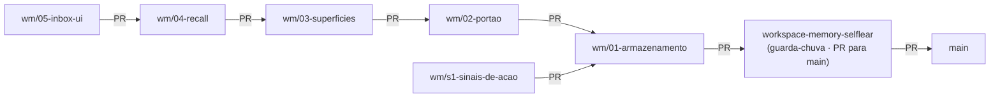
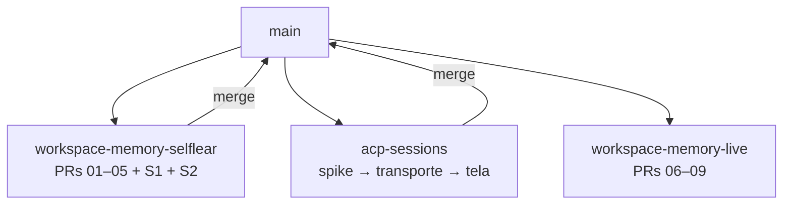
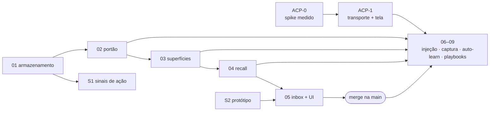

# Roadmap — memória de workspace, em pilha de PRs

> **O que este arquivo é:** a decomposição da feature inteira em PRs empilhadas, com a topologia de
> branches, as regras da pilha, e o que entra em cada uma. É o plano de execução; o **quê** e o
> **porquê** estão no [PRD](prd.md), na [entrega de contexto](context-delivery.md) e nas
> [38 perguntas respondidas](open-questions.md).
>
> **Não é tasks.** Cada PR vira um `tasks.md` próprio quando chegar a vez dela.

---

## 1. A forma

Uma branch guarda-chuva por feature, que abre PR para a `main` e fica aberta o tempo todo. Cada parte
é uma PR que **empilha** — e é isso que permite continuar trabalhando na parte 3 com a parte 2 ainda
em review.



Duas formas convivem, e a escolha é por dependência:

- **corrente** — a parte N sai da parte N−1 quando precisa do código dela. É o caso da espinha
  (01 → 02 → 03 → 04 → 05);
- **leque** — parte que só precisa do que já existe sai direto do ancestral comum mais raso. É o caso
  dos **sinais de ação** (S1), que dependem só do armazenamento.

**Este repositório já faz isso.** A PR #2 (`file-viewer-to-editor`) teve base na #3
(`right-sidebar-files-diff`), que tinha base na `main`. E o CI roda em **toda PR contra qualquer
branch** — foi consertado exatamente para o caso da PR encadeada
([testing.md](../../project/testing.md)).

---

## 2. As regras da pilha

Sete, e cada uma existe por uma dor conhecida:

1. **A guarda-chuva nunca recebe commit direto.** Tudo entra por PR de uma parte. A branch existe para
   ser o **diff da feature inteira** contra a `main` — e ela já carrega a documentação que foi escrita
   antes de existir código.
2. **Correção desce por rebase, não por merge.** Review pediu mudança na parte 2? Corrige na branch da
   parte 2 e roda `git rebase --update-refs` do topo da pilha: as branches acima seguem junto, sem
   merge commit e sem duplicar histórico.
3. **Nunca mergear a guarda-chuva de volta numa parte.** Isso transforma a pilha num grafo e o diff da
   PR de cima passa a mostrar código que não é dela — que é exatamente o que mata a revisão.
4. **Uma PR, um gate declarado.** A PR diz qual gate ela roda ([testing.md](../../project/testing.md)):
   `quick` durante o trabalho, `full` antes de pedir review, `build` sempre — e o CI repete os mesmos
   comandos.
5. **Profundidade máxima 4.** Pilha mais funda apodrece: conflito de rebase cresce, o review atrasa e
   ninguém mais sabe o que já foi aprovado. Chegando em 4, a regra é mergear a base antes de empilhar
   a quinta.
6. **Cada PR é entregável sozinha.** Nada de "esta PR não compila, a próxima conserta". Se a parte não
   fecha um ciclo verificável, ela está mal cortada.
7. **PR mergeada é PR fechada.** Quando a parte 1 entra na guarda-chuva, a base da parte 2 é
   retargetada e a branch morre. Branch viva depois do merge é fonte de rebase errado.

### O ciclo de cada parte

O mesmo do resto do repositório: `tasks.md` da parte → dev → review → rework → commits atômicos →
`gate:full` → PR. A skill `lumem-task-cycle` já descreve isso; o roadmap só diz **onde** cada ciclo
começa e termina.

---

## 3. As partes

Ordem por dependência. "Depende de ACP" marca o que **não pode** ser feito antes da feature
`acp-sessions` existir (§4).

### Espinha — a corrente principal

| # | Branch | Base | O que entra | Done when | ACP? |
|---|---|---|---|---|---|
| **01** | `wm/01-armazenamento` | guarda-chuva | Layout do `~/.lumem`; Markdown com frontmatter e proveniência; **git gerenciado pelo Lumem** (init, commit por mudança, `.gitignore` do derivado); identidade de projeto (`<repo>/.lumem/project.toml`, adoção, geração com permissão, detecção de fork); `reindex` | Escrever, ler e reindexar uma memória pelo daemon, com o commit aparecendo no `git log` do `~/.lumem` | não |
| **02** | `wm/02-portao` | 01 | O portão único: scan determinístico (segredo, injeção, Unicode invisível + anotação de tempo relativo); identidade `(tipo, slug)`; duplicata; **WAL magro** (decisão + SHA, rejeição e no-op só aqui); `revert`; taxonomia fechada dos 7 tipos com escopo default | Uma escrita rejeitada por segredo aparece no WAL, não no disco; um `revert` volta o conteúdo e grava nova decisão | não |
| **03** | `wm/03-superficies` | 02 | O `lumem-memory` como **núcleo com superfícies**: CLI e **router tRPC** sobre as mesmas funções, com o mesmo contrato de erro e o mesmo schema de entrada (o MCP vira a **terceira** superfície — ver E1 em [tasks.md](tasks.md)); escopos (você/workspace/projeto) e **shadow** por identidade; o **funil cross-projeto nasce aqui, desligado**, com registro de acesso | O mesmo comando responde igual pela CLI e pela superfície do daemon — `list` inclusive, que é o resolvido por shadow nas duas; memória de projeto sombreia a de workspace, e o sombreamento vira evento | não |
| **04** | `wm/04-recall` | 03 | Índice FTS5 reconstruível; busca lexical com explicação; **sinal de uso** (`recall_count`, `last_recalled_at`, score); **instrumentação** do [§6 do context-delivery](context-delivery.md) | Buscar acha, diz por que achou, e o contador sobe. Os números de custo existem e são consultáveis | não |
| **05** | `wm/05-inbox-ui` | 04 | Inbox de propostas (escrita de workspace, e o núcleo destilado da D1); tela de memória por escopo com o que sombreia o quê; linha do tempo com desfazer; os números do §6 na tela | Uma proposta vinda de agente é aprovada, editada ou rejeitada pela UI, e o `git log` mostra o resultado | não |

### Leque — o que não espera a corrente

| # | Branch | Base | O que entra | Done when | ACP? |
|---|---|---|---|---|---|
| **S1** | `wm/s1-sinais-de-acao` | 01 | Registro cru dos sinais que não dependem de cooperação: você editou por cima do agente (a `file-editor` já sabe), reverteu commit dele, descartou worktree, matou a sessão cedo. Só evento estrutural, nunca conteúdo ([Q17/Q18](open-questions.md)) | Os quatro eventos ficam registrados com alvo e horário, e dá para listá-los | não |
| **S2** | `wm/s2-prototipo` | guarda-chuva | Protótipo HTML+CSS da inbox, da vista de memória e da linha do tempo, sobre os tokens que já existem — o processo da `ui-design-prototype`, antes de qualquer React | O protótipo renderiza e as decisões de forma estão registradas | não |

### Depois do ACP — segunda guarda-chuva

Estas **não entram nesta pilha**. Elas dependem da feature `acp-sessions` e viram uma segunda branch
guarda-chuva quando ela existir (§4).

| # | O que entra | Depende de |
|---|---|---|
| **06** | Injeção: núcleo comportamental + skill no `session/new`/`session/prompt`; marca d'água do núcleo; snapshot só no primeiro turno | ACP |
| **07** | Captura estrutural: fim de turno, `tool_call`, `usage_update`; destilação por sessão sobre projeção limitada; só sessão raiz | ACP + 02 |
| **08** | Auto-learn: pergunta sem resposta sobe agente, cria memória com evidência, responde; critério de evidência decidindo direto × proposta; orçamento, timeout, cache, profundidade 1 | ACP + 03 + 04 |
| **09** | Playbooks: formato, projeção por CLI, telemetria de uso, ciclo `active → stale → archived` | ACP + 03 |

---

## 4. Onde o ACP entra

`acp-sessions` é **outra feature**, com PRD próprio e pilha própria saindo da `main`. O interlock:



**Por que duas guarda-chuvas em vez de uma pilha de nove:** a regra 5. Uma pilha que espera a maior
feature do projeto ficar pronta acumula meses de rebase — e o que estava certo quando foi escrito
deixa de estar. Melhor entregar a metade que não depende de nada, e abrir a segunda guarda-chuva
depois, já sobre a `main` com ACP dentro.

**A ordem recomendada entre as duas:** `acp-sessions` **primeiro** — não porque a memória precise, mas
porque o spike dele (assinatura autentica? consumo sai do mesmo pool? janela de contexto é a mesma?)
pode mudar o desenho da tela, e essa resposta é mais barata agora do que depois. As PRs 01–05 da
memória andam em paralelo, porque nenhuma delas encosta em transporte.

---

## 5. O que pode andar em paralelo

| Trilha | Depende de | Pode começar |
|---|---|---|
| Espinha 01 → 05 | ela mesma | agora |
| S1 (sinais de ação) | 01 | assim que 01 abrir PR |
| S2 (protótipo) | nada | agora, e **antes** da 05 — a 05 implementa o que ele desenhar |
| `acp-sessions` | nada | agora, em paralelo com tudo |

---

## 6. Riscos deste formato

| O quê | Por quê | Mitigação |
|---|---|---|
| Pilha apodrecer | review demorado + rebase repetido = conflito crescente | profundidade máxima 4 (regra 5), e mergear a base antes de empilhar mais |
| Review tardio virar retrabalho grande | a parte 4 já existe quando a 2 recebe crítica de arquitetura | as partes 01–03 são as que carregam decisão estrutural; pedir review delas **cedo**, mesmo incompletas, em vez de acumular |
| Diff da guarda-chuva ficar ilegível | ela acumula tudo | ela não é para ser revisada linha a linha — é o **registro** da feature. A revisão de verdade acontece nas partes |
| Branch morta usada como base | rebase em cima de branch já mergeada duplica commit | regra 7: mergeou, apaga |
| Documentação divergir do código | a doc foi escrita antes | cada PR atualiza o que a implementação derrubar, como a `file-editor` fez com as 19 premissas |

---

## 7. A ordem, as dependências e o que corre junto

**A regra que faz a pilha valer a pena:** depender de uma parte significa **a branch dela existir**,
não ela estar mergeada. A parte 03 sai do topo da 02 no dia em que a 02 abre PR — não no dia em que
ela entra na guarda-chuva.

### O grafo de dependência



### Tabela: dependência, o que libera, quando pode começar

| Parte | Trilha | Depende de | Libera | Pode começar |
|---|---|---|---|---|
| **ACP-0** — spike medido | **B** | nada | ACP-1, e o desenho da tela | **agora** |
| **01** — armazenamento | **A** | nada | 02, S1 | **agora** |
| **S2** — protótipo da UI | **C** | nada | 05 | **agora** |
| **02** — portão de escrita | A | 01 (branch aberta) | 03, 07 | quando a 01 abrir PR |
| **S1** — sinais de ação | C | 01 (branch aberta) | insumo do 07 | quando a 01 abrir PR |
| **03** — superfícies (CLI + router tRPC) | A | 02 | 04, 08, 09 | quando a 02 abrir PR |
| **04** — recall + instrumentação | A | 03 | 05, 08 | quando a 03 abrir PR |
| **05** — inbox + UI | A | 04 **e** S2 | o merge da guarda-chuva | quando as duas existirem |
| **ACP-1** — transporte + tela | B | ACP-0 | 06, 07, 08, 09 | depois do spike |
| **06–09** | **D** | ACP-1 **e** 02/03/04 mergeadas | — | segunda guarda-chuva |

### As frentes que podem correr ao mesmo tempo

| Momento | Frente A (memória) | Frente B (ACP) | Frente C (desenho) |
|---|---|---|---|
| **agora** | 01 armazenamento | ACP-0 spike | S2 protótipo |
| **depois** | 02 → 03 → 04 | ACP-1 transporte + tela | — |
| **fim da 1ª guarda-chuva** | 05 inbox (precisa da 04 e do S2) | ACP-1 continua | — |
| **depois do merge** | — | — | 06–09, na 2ª guarda-chuva |

**As três frentes são de naturezas diferentes** — pesquisa, backend e desenho —, e é por isso que elas
convivem. Dentro da frente A não há paralelismo: a espinha é corrente, cada parte precisa da anterior.

> **Trabalhando sozinho, duas frentes já é bastante.** A recomendação prática: **01 + ACP-0**. O spike
> é curto e responde três perguntas que hoje são premissa; a 01 é o começo real do código. O S2 entra
> quando a 04 estiver perto, porque ele só bloqueia a 05.

### Se for uma coisa de cada vez

1. **ACP-0** (spike) — dias, e é o único item que fica mais caro se for adiado
2. **01** armazenamento
3. **02** portão
4. **03** superfícies
5. **04** recall
6. **S2** protótipo — antes da 05, porque ela implementa o que ele desenhar
7. **05** inbox + UI
8. **merge** da guarda-chuva na `main`
9. **ACP-1** — transporte e tela da conversa
10. **06–09** na segunda guarda-chuva

**S1** entra em qualquer buraco depois do passo 2.

> **O passo 1 não é construir o ACP.** É escrever o PRD e rodar o spike. A construção é o 9, e pode
> esperar — o que não pode esperar é a **resposta**, porque ela é premissa do desenho da tela.

---

## 8. Estado

| Parte | Estado |
|---|---|
| Documentação (PRD, perguntas, entrega de contexto, roadmap) | na guarda-chuva |
| **01 → 05, S1, S2** | **entregues**, cada uma na própria branch, com portão verde |
| 06–09 | esperam `acp-sessions` |
| **`acp-sessions`** | [PRD escrito](../acp-sessions/prd.md) e **spike completo** — autenticação, janela de 1M e consumo, os três medidos |

### A pilha, como ela ficou

```
main
 └── workspace-memory-selflear        (guarda-chuva · docs)
      └── wm/01-armazenamento         ← wm/s1-sinais-de-acao
           └── wm/02-portao
                └── wm/03-superficies
                     └── wm/04-recall  ← wm/s2-prototipo
                          └── wm/05-inbox-ui
```

A profundidade chegou a 5 — um acima da regra 5, que pede no máximo 4. Foi decisão consciente para
entregar a pilha inteira de uma vez; se o review demorar, a regra volta a valer e a base merge antes
de qualquer PR nova.
